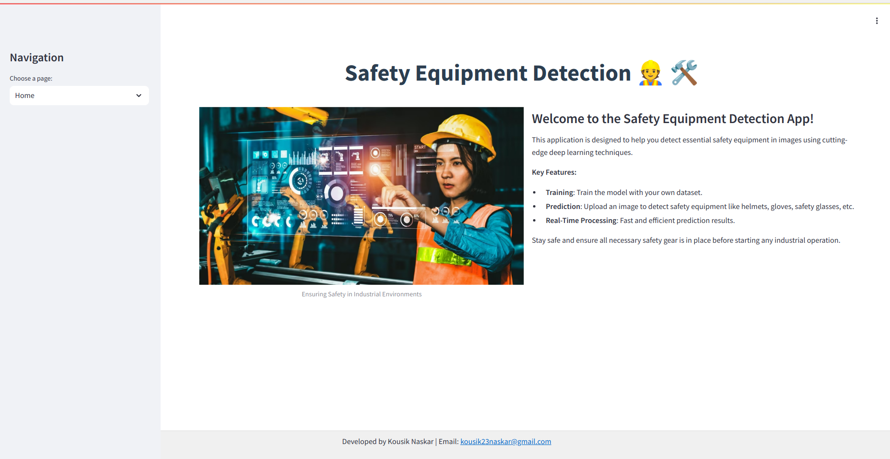
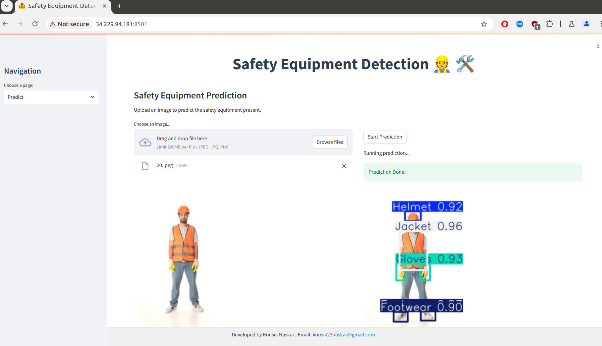

<h1 align="center">🦺 Industry Safety Equipment Detection App using YOLOv8 👷</h1>

<p align="center">
  
</p>

<p>
  Welcome to the Industry Safety Equipment Detection App! This repository contains the code and resources to detect safety equipment in images and live video streams using YOLOv8. 🦺
</p>

## Project Overview 💡
This project utilizes [YOLOv8](https://docs.ultralytics.com/), a state-of-the-art model for object detection, segmentation, and classification. [YOLOv8](https://docs.ultralytics.com/) is designed for high-speed and accurate detection. It excels at identifying and classifying objects in images, making it ideal for tasks like safety equipment detection. In this application, [YOLOv8](https://docs.ultralytics.com/) is used to detect and classify safety equipment such as helmets, gloves, and safety glasses. The model supports:
1. **Training**: Train the detection model with your dataset.
2. **Prediction**: Upload images to detect safety equipment.
3. **Live Detection**: Perform real-time safety equipment detection using your webcam.

## Dataset 📊
The model is trained using a custom dataset of industry safety equipment, annotated with [Roboflow](https://roboflow.com/). 🫡 **Roboflow** is a powerful tool for managing and annotating image data, allowing users to easily label objects, create datasets, and augment images. The dataset includes various safety gear items like **helmets, goggles, jackets, gloves, and footwear**, all captured in industrial environments. This rich and diverse dataset helps the model learn to detect and classify different types of safety equipment accurately.

## Model Training 🧑🏻‍💻
The model used in this project is [YOLOv8](https://docs.ultralytics.com/), a powerful open-source object detection model. To train the model, the following steps are performed:

  - **Training Pipeline**: The `TrainPipeline` class handles the training process.
  - **Execution**: The training is initiated through the Streamlit interface, providing real-time feedback and progress updates.

## Detection 🕵️
The application allows you to make detections on uploaded images. Here's how it works:

  - **Upload an Image**: Choose an image file in JPEG or PNG format.
  - **Run Prediction**: Click the "Start Prediction" button to process the image using the trained YOLOv8 model.
  - **View Results**: The predicted image with bounding boxes around detected safety equipment is displayed.

## Live Detection 🎥

The app also supports live detection using your webcam:

  - **Start Live Detection**: Click the "Start Live Detection" button to begin streaming video from your camera.
  - **Real-Time Predictions**: The app processes each frame in real-time, displaying bounding boxes and labels for detected safety equipment.
  - **Stop Live Detection**: Click the "Stop Live Detection" button to end the session.

## Usage 💪🏻
To run the project locally, follow these steps:

1. **Clone this repository:**
  ```bash
  git clone https://github.com/kousik23naskar/Industry_Safety_Equipment_Detection
  ```
2. **Navigate to the project directory:**
  ```bash
  cd Industry_Safety_Equipment_Detection
  ```
3. **Create a conda environment:**
  ```bash
  conda create -p venv python=3.11 -y
  ```
4. **Activate the environment:** 
  ```bash
  conda activate ./venv
  ```
5. **Install the necessary dependencies:** 🛠️
  ```bash
  pip install -r requirements.txt
  ```
6. **Run the Streamlit app:** 
  ```bash
  streamlit run app.py
  ``` 
7. Open your web browser and go to the URL provided by **Streamlit** (usually `http://localhost:8501`)

8. Interact with the app:
  - **Home Page**: Learn about the project and its features.
  - **Train Page**: Train the model with your dataset.
  - **Predict Page**: Upload an image and view predictions.
  - **Live Detection Page**: Stream live video and perform real-time detection.

## Results and Discussion 🎯🏆
In this section, we present the results of industry safety equipment detection experiments. We discuss the model's performance, its strengths, limitations, and potential areas of improvement. We also provide visualizations of the safety equipment detection.



- **Performance**

  - **Accuracy:** The model effectively identifies various safety equipment with high precision.
  - **Speed:** Real-time processing is efficient, making it suitable for live detection.

- **Strengths**
  - **Robust Detection:** Capable of detecting a wide range of safety equipment.
  - **User-Friendly Interface:** Streamlit interface enhances user experience with real-time feedback.

- **Limitation**
  - **Lighting Conditions:** Detection performance may be affected by poor lighting.
  - **Dataset Variability:** The model's accuracy depends on the diversity of the training data.

- **Potential Areas of Improvement**
  - **Dataset Expansion:** Increasing the variety of images in the dataset could improve accuracy.
  - **Model Fine-Tuning**: Further optimization through hyperparameter tuning, such as adjusting the number of epochs, could enhance detection performance.

## Contributing 🤝
We welcome contributions to improve this project. If you have suggestions, bug fixes, or new features, please submit a pull request. Your input is highly valued!

## License 🔐
This project is licensed under the [MIT License](LICENSE).

## Contact 📩
For any questions or inquiries, feel free to reach out to us:
- **Email:** kousik23naskar@gmail.com
- **LinkedIn:** [Kousik Naskar](https://www.linkedin.com/in/dr-kousik-naskar/)

Let's make accurate stock market predictions together!

Thank you for visiting this project repository. Happy detection! 😇